# VSCode 및 Antigravity IDE에서 Tomcat 연동하기: Redhat Community Server Connectors 사용 가이드

Java 웹 프로젝트를 개발할 때 Eclipse나 IntelliJ와 같은 전통적인 IDE를 사용하면 Tomcat 서버 연동이 비교적 수월합니다. 하지만 최근 널리 사용되는 VSCode나 Antigravity, Cursor와 같은 모던 IDE 환경에서는 Tomcat 서버를 연동하고 관리하는 과정이 다소 복잡하게 느껴질 수 있습니다. 

이번 포스팅에서는 **Redhat Community Server Connectors** 확장을 활용하여 IDE 내에서 손쉽게 Tomcat 서버를 연동하고, 웹 프로젝트를 배포 및 실행하는 방법에 대해 상세히 알아보겠습니다.

---

## 1. 테스트 환경 준비 (IDE)

본 가이드에서는 VSCode 대신, 최근 주목받고 있는 **Antigravity IDE**를 기준으로 설명합니다. (VSCode 및 Cursor 환경에서도 동일한 방식으로 적용할 수 있습니다.)

* **Antigravity IDE 다운로드**: [공식 홈페이지 링크](https://antigravity.google/product/antigravity-ide)

---

## 2. 필수 확장 프로그램(Extension) 설치

IDE에서 Java 웹 프로젝트를 정상적으로 구동하기 위해 기본 Java 환경 설정이 완료되었다고 가정합니다. 아래의 확장 프로그램들이 필요합니다.

1. **Extension Pack for Java**
   * [마켓플레이스 링크](https://open-vsx.org/vscode/item?itemName=vscjava.vscode-java-pack)
   * Java 개발에 필요한 핵심 기능들이 포함된 패키지입니다.

2. **Runtime Server Protocol UI**
   * [마켓플레이스 링크](https://open-vsx.org/vscode/item?itemName=redhat.vscode-rsp-ui)
   * 서버 프로토콜의 UI를 제공하는 확장입니다.

3. **Community Server Connectors**
   * [마켓플레이스 링크](https://open-vsx.org/vscode/item?itemName=redhat.vscode-community-server-connector)
   * 이번 가이드의 핵심인 Tomcat 등 다양한 WAS(Web Application Server)와의 연동을 지원하는 확장입니다.

---

## 3. IDE에서 웹 프로젝트 로드 및 설정

예제로 사용할 `spring-mvc-sample` 프로젝트를 루트 경로로 지정하여 IDE에서 로드하면 다음과 같은 화면을 확인할 수 있습니다.

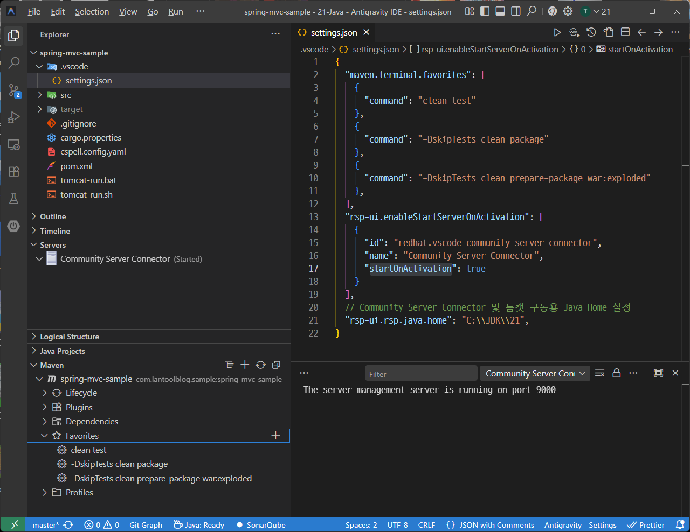

원활한 프로젝트 진행을 위해 `.vscode/settings.json` 파일에 Maven 실행 명령과 RSP 관련 설정을 미리 추가해 두었습니다.

* **Maven 바로가기**: 좌측 하단에 설정한 Maven 빌드 명령이 표시되며, 클릭 시 즉시 실행 가능합니다.
* **rsp-ui.startOnActivation**: Community Server Connector의 백엔드 서버 자동 시작 여부를 설정합니다. 웹 프로젝트 개발 시에는 활성화해 두는 것을 권장합니다.
* **rsp-ui.rsp.java.home**: 프로젝트에 사용되는 Java 버전에 맞게 경로를 지정합니다.

---

## 4. 예제 프로젝트 빌드 및 war:exploded

좌측 하단의 즐겨찾기 명령을 통해 프로젝트를 빌드합니다.

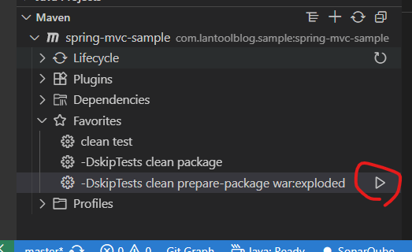

빌드가 완료된 후 `target` 디렉터리를 확인해 보면, Tomcat에 배포할 파일들이 성공적으로 생성된 것을 볼 수 있습니다.

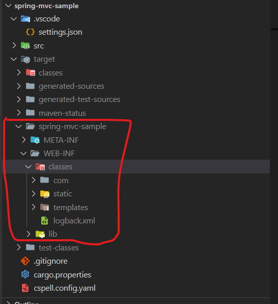

---

## 5. Tomcat 서버 다운로드 및 준비

Community Server Connector에는 WAS 자동 다운로드 기능이 내장되어 있습니다. 하지만 서버 파일들을 더 체계적으로 관리하기 위해, 별도의 디렉터리를 생성하고 공식 홈페이지에서 Tomcat을 수동으로 다운로드하여 연동하는 방식을 추천합니다.

본 가이드에서는 `G:\redhat-community-server-connector` 경로에 Tomcat 10.1.55 버전을 다운로드하여 압축을 해제했습니다.

```text
G:\redhat-community-server-connector
  │   apache-tomcat-10.1.55-windows-x64.zip
  │
  └───apache-tomcat-10.1.55\
```

* **Tomcat 10.1.55 (Windows 64bit) 다운로드**: [Apache Tomcat 공식 다운로드 링크](https://dlcdn.apache.org/tomcat/tomcat-10/v10.1.55/bin/apache-tomcat-10.1.55-windows-x64.zip)

---

## 6. Community Server Connector에 서버 추가 및 배포

이제 준비된 Tomcat 서버를 IDE에 등록할 차례입니다.

### 6.1 서버 등록
1. IDE의 Server 뷰(Community Server Connector)에서 우클릭 후 **Create New Server...**를 클릭합니다.
   
   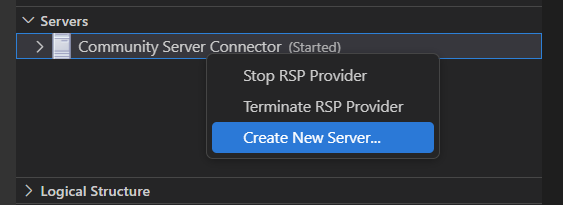

2. 서버를 다운로드할지 묻는 알림 창이 나타나면, 수동으로 다운로드한 파일을 사용할 것이므로 **No**를 선택합니다.
   
   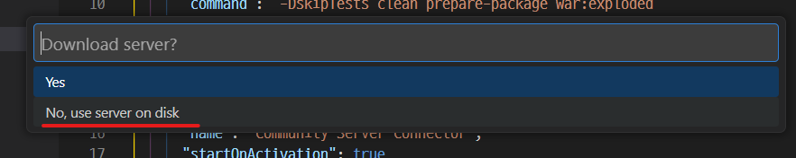

3. 압축을 해제한 Tomcat 경로(`G:\redhat-community-server-connector\apache-tomcat-10.1.55`)를 지정합니다.
   
   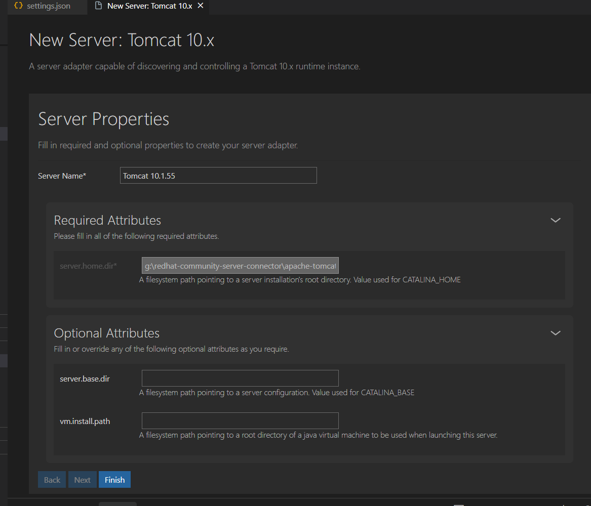

4. 서버 이름은 식별하기 쉽도록 `Tomcat 10.1.55`와 같이 명시적으로 지정해 줍니다.

### 6.2 프로젝트 배포 (Add Deployment)
추가된 서버에 빌드된 프로젝트를 배포해야 합니다.

1. 추가한 서버 항목에서 우클릭 후 **Add Deployment**를 선택합니다.
   
   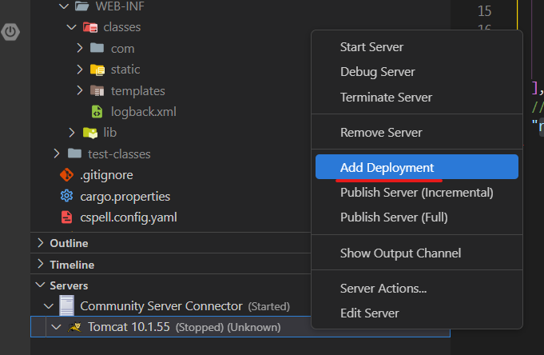

2. 배포 타입 선택 창이 나타나면, 단일 WAR 파일 대신 빌드된 디렉터리를 바로 사용할 것이므로 **Exploded**를 선택합니다.
   
   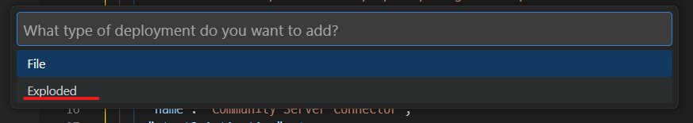

3. 빌드 출력 경로인 `{프로젝트 루트}\target\spring-mvc-sample`을 선택합니다.

4. 배포 파라미터 추가 여부를 묻는 창에서 **Yes**를 선택합니다. 파라미터를 입력하지 않으면 Context Root가 프로젝트 이름으로 고정됩니다.
   
   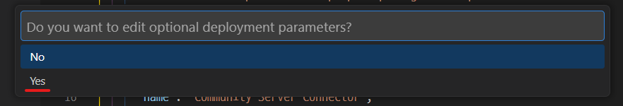

5. 출력 이름을 **ROOT**로 지정합니다. (참고로, Exploded 방식이 아닌 WAR 방식이라면 `ROOT.war`로 입력해야 합니다.)
   
   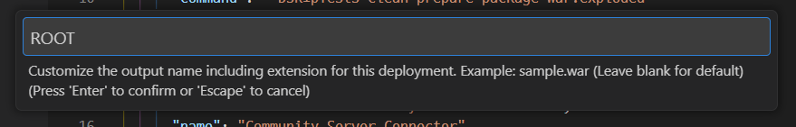

6. 이어지는 추가 파라미터 입력 창은 빈 상태로 두고 넘어갑니다.
   
   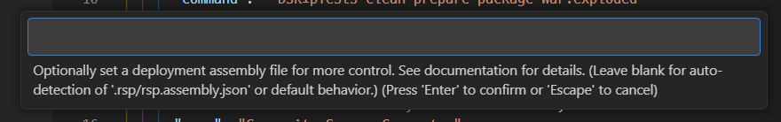

### 6.3 배포 동기화 (Full Publish)
배포 설정이 완료되면 동기화를 위한 **Full Publish** 요청 알림이 나타납니다.

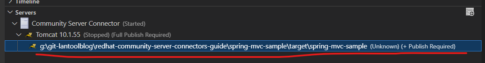
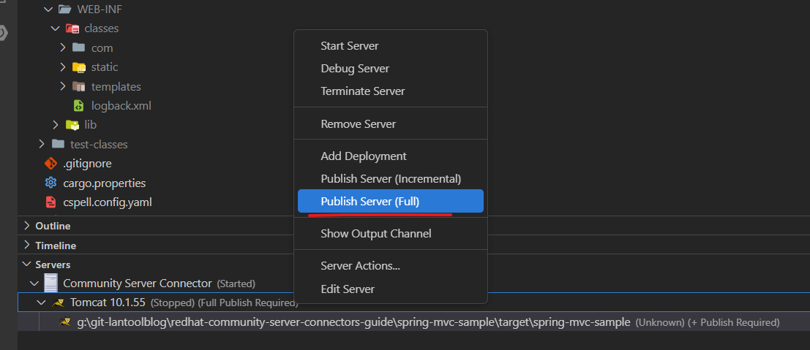

안내에 따라 **Yes**를 클릭하여 퍼블리시를 진행하면 상태가 정상적으로 동기화됩니다.

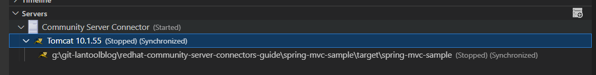

---

## 7. 서버 실행 및 결과 확인

모든 설정이 완료되었습니다. 이제 서버를 실행해 보겠습니다.

1. Tomcat 서버 항목을 우클릭하고 **Start Server**를 클릭합니다.
   
   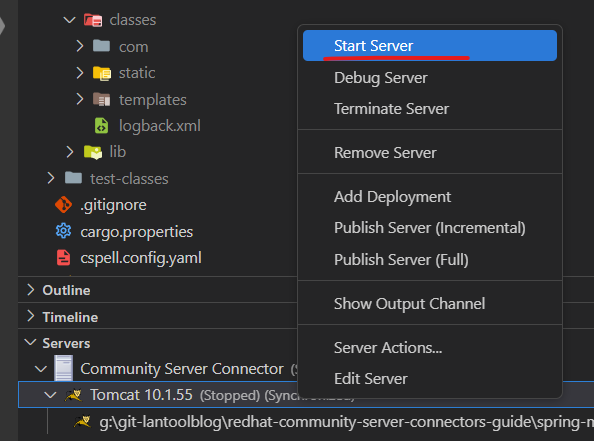

2. IDE 하단의 Output 탭에서 Tomcat 서버의 실행 로그가 정상적으로 출력되는지 확인합니다.
   
   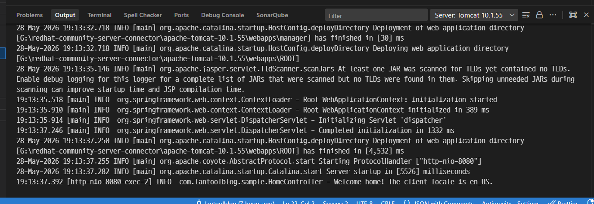

3. 브라우저를 열고 `http://localhost:8080`에 접속하여 웹 애플리케이션이 정상적으로 구동되는지 확인합니다.
   
   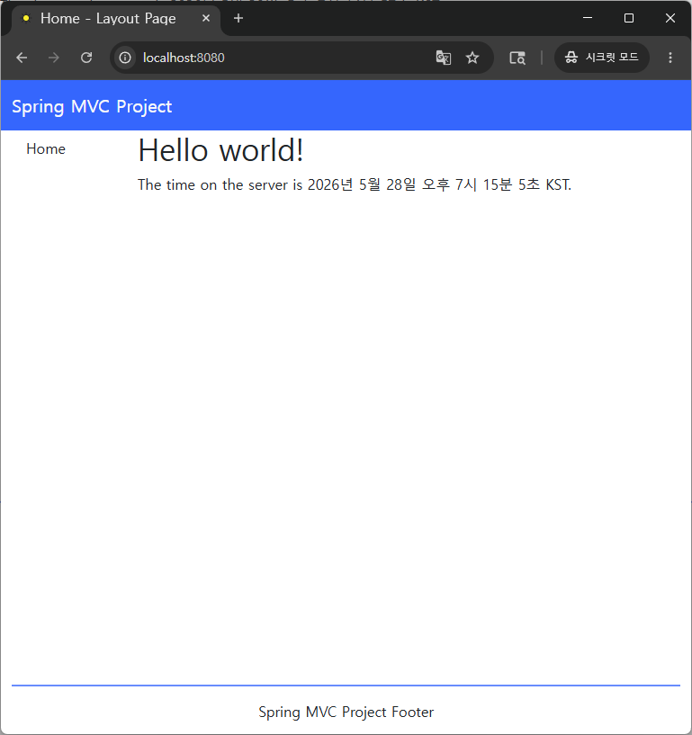

화면이 정상적으로 렌더링된다면 연동에 성공한 것입니다! 👍

---

## 8. 마무리

처음 환경을 구성할 때는 전용 도구가 잘 갖춰진 Eclipse나 IntelliJ 환경에 비해 다소 번거롭게 느껴질 수 있습니다. 하지만, 직접 설정 파일들을 건드리며 구성하는 것보다는 Redhat Community Server Connectors를 활용하는 편이 관리 측면에서 훨씬 수월하고 효율적입니다. 

VSCode나 Antigravity IDE를 활용하여 Java 웹 프로젝트를 구축하시려는 분들께 이 가이드가 도움이 되기를 바랍니다. 😊